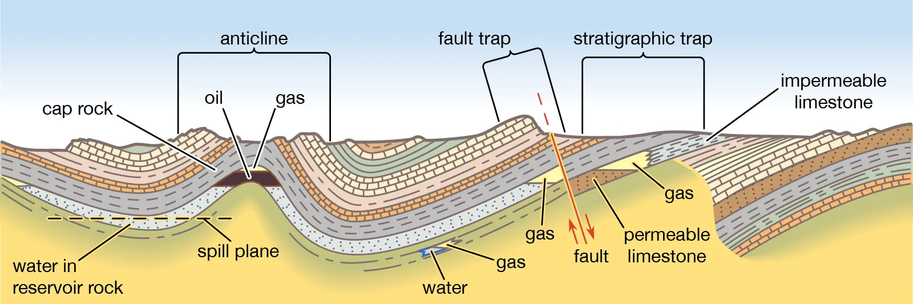

# Oil and Gas Reservoir Prediction

## Overview

This project focuses on utilizing machine learning techniques to predict crucial parameters—Permeability, Porosity, Lithology, and Fluid Content—in oil and gas reservoirs. Leveraging well log data, which includes density and resistivity measurements, we employ advanced machine learning models like Decision Trees and Random Forest Algorithms for accurate predictions.

## Key Features

- Predict key reservoir parameters: permeability, porosity, lithology, and fluid content.
- Utilize machine learning algorithms: Decision Trees and Random Forests.
- Leverage well log data including density and resistivity measurements.
- Enhance reservoir characterization for improved decision-making in the petroleum industry.

